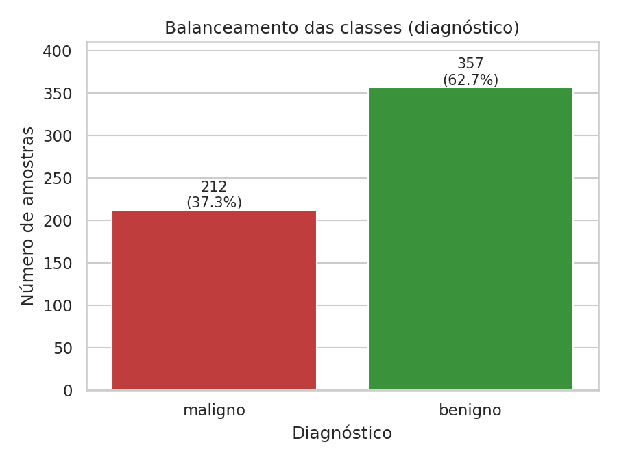
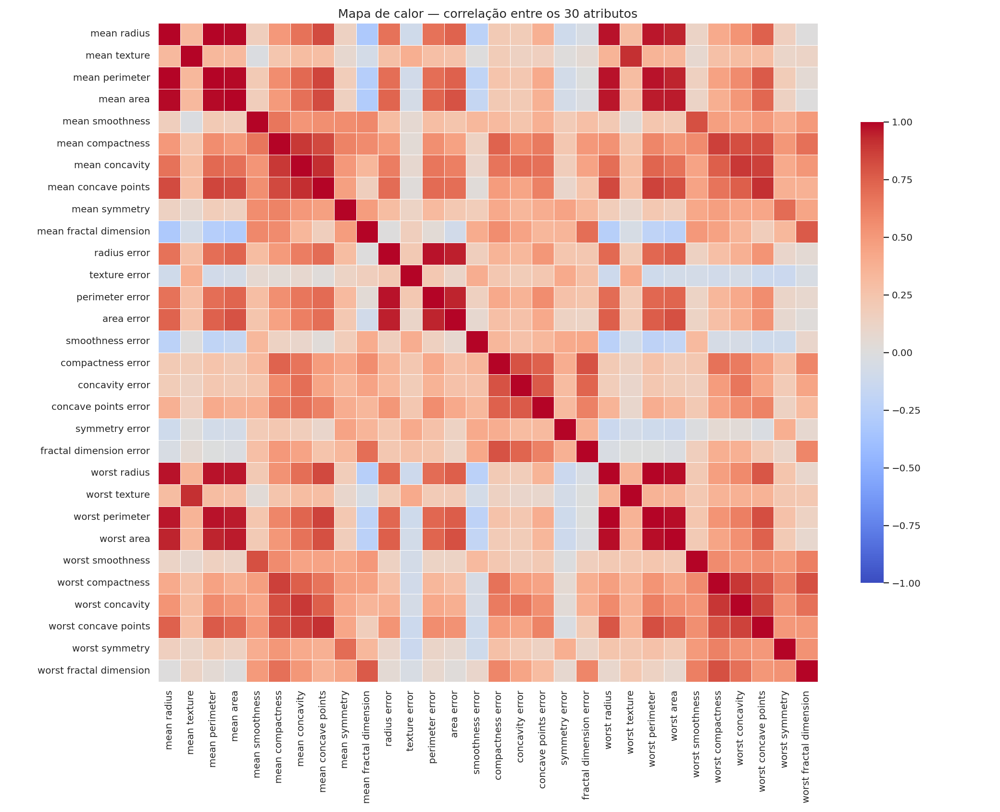
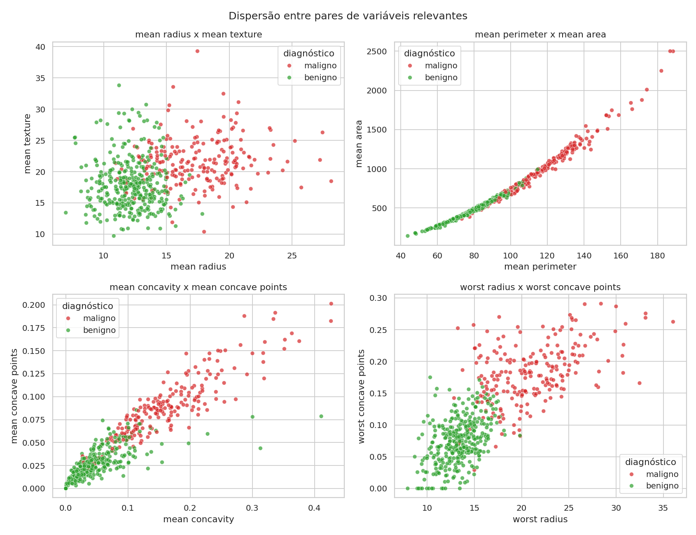
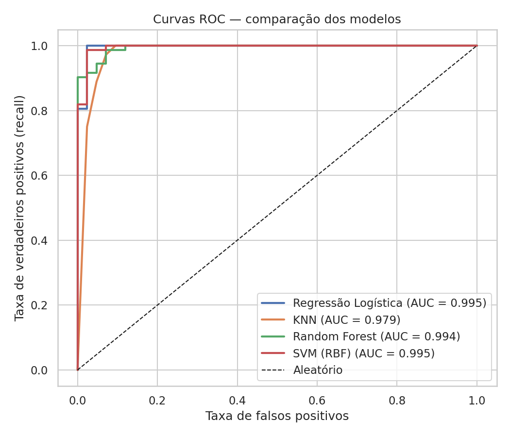
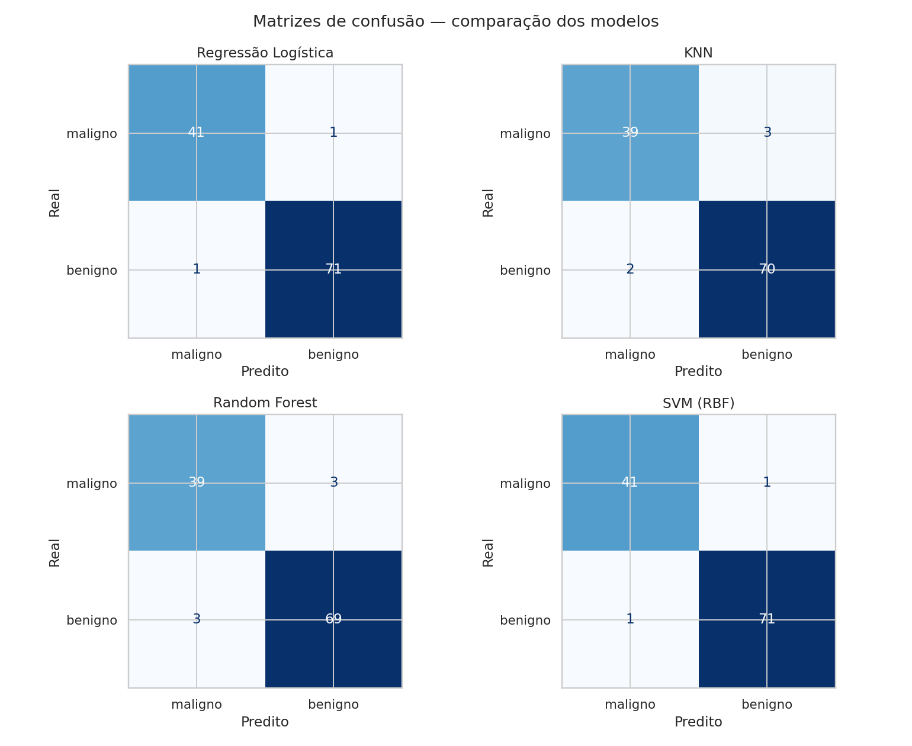

<!-- _class: lead -->

# Explorando Toy Datasets do Scikit-Learn
## Breast Cancer Wisconsin (Diagnostic) Dataset

**Grupo 6 — Classificação Binária**
Carlos · Pedro · Luiz · Victor · Vinicius · Wesley

Disciplina de Inteligência Artificial · Junho/2026

---

# 1. O problema e o dataset

- **Tema:** diagnóstico de câncer de mama (maligno × benigno)
- **Origem:** medições de núcleos celulares em aspirados por agulha fina (FNA)
- **569 amostras · 30 atributos** numéricos contínuos
  - 10 características × 3 agregações (*mean*, *error*, *worst*)
- **Alvo binário:** `0 = maligno` · `1 = benigno`
- **Relevância:** diagnóstico precoce é determinante para o prognóstico

---

# 2. EDA — Balanceamento das classes

Desbalanceamento **moderado** (37% maligno / 63% benigno) → uso de **estratificação** e métricas além da acurácia.

---

# 2. EDA — Correlação com o diagnóstico

Atributos mais associados ao alvo:

- `worst concave points` (−0,79)
- `worst perimeter` (−0,78)
- `mean concave points` (−0,78)
- `worst radius` (−0,78)

Forte **multicolinearidade** entre `radius`/`perimeter`/`area`.

---

# 3. Separabilidade das classes

Tumores malignos → valores maiores de raio, perímetro e concavidade.

---

# 4. Pré-processamento e split

- **Sem valores faltantes** e **sem variáveis categóricas**
- **Padronização** com `StandardScaler` (média 0, desvio 1)
  - Necessária pela disparidade de escalas (ex.: `mean area` vs. `mean smoothness`)
  - Ajustada **só no treino** → evita *data leakage*
- **Split 80/20** estratificado, `random_state=42`
  - Treino: 455 · Teste: 114 (proporção de classes preservada)

---

# 5. Modelagem — 4 algoritmos comparados

| Modelo | CV Acurácia (cv=5) | CV F1 |
|---|---|---|
| Regressão Logística | 0,9802 ± 0,013 | 0,9843 |
| SVM (RBF) | 0,9714 ± 0,018 | 0,9773 |
| KNN (k=5) | 0,9670 ± 0,021 | 0,9741 |
| Random Forest | 0,9582 ± 0,022 | 0,9668 |

Validação cruzada (cv=5) sobre o conjunto de treino.

---

# 6. Resultados no conjunto de teste

| Modelo | Acurácia | F1 | Recall maligno | ROC-AUC |
|---|---|---|---|---|
| **Regressão Logística** | **0,9825** | **0,9861** | 0,9762 | **0,9954** |
| **SVM (RBF)** | **0,9825** | **0,9861** | 0,9762 | 0,9950 |
| KNN | 0,9561 | 0,9655 | 0,9286 | 0,9788 |
| Random Forest | 0,9474 | 0,9583 | 0,9286 | 0,9937 |

Melhores modelos: **apenas 2 erros em 114 amostras**.

---

# 6. Curvas ROC e matrizes de confusão

---

# 7. Por que o *recall maligno* importa?

- Em diagnóstico médico, o erro mais grave é o **falso negativo**
  - (câncer classificado como benigno → atraso no tratamento)
- Melhores modelos: **recall maligno = 0,976** → **1 falso negativo** no teste
- **Aplicação real:** sistema de **apoio à decisão** para triagem
  - complementar ao laudo médico, **nunca substituto**

---

# 8. Conclusões e limitações

**Conclusões**
- Pipeline completo com **acurácia de 98,25%** e ROC-AUC de 0,995
- Classes praticamente **linearmente separáveis** após padronização

**Limitações & trabalhos futuros**
- Dataset pequeno e de fonte única → validar em bases externas
- Otimizar hiperparâmetros (`GridSearchCV`)
- Tratar **custo assimétrico** dos erros (ajuste de limiar) e interpretabilidade (SHAP)

---

<!-- _class: lead -->

# Obrigado!

**Perguntas?**

Grupo 6 — Breast Cancer Dataset · Inteligência Artificial
